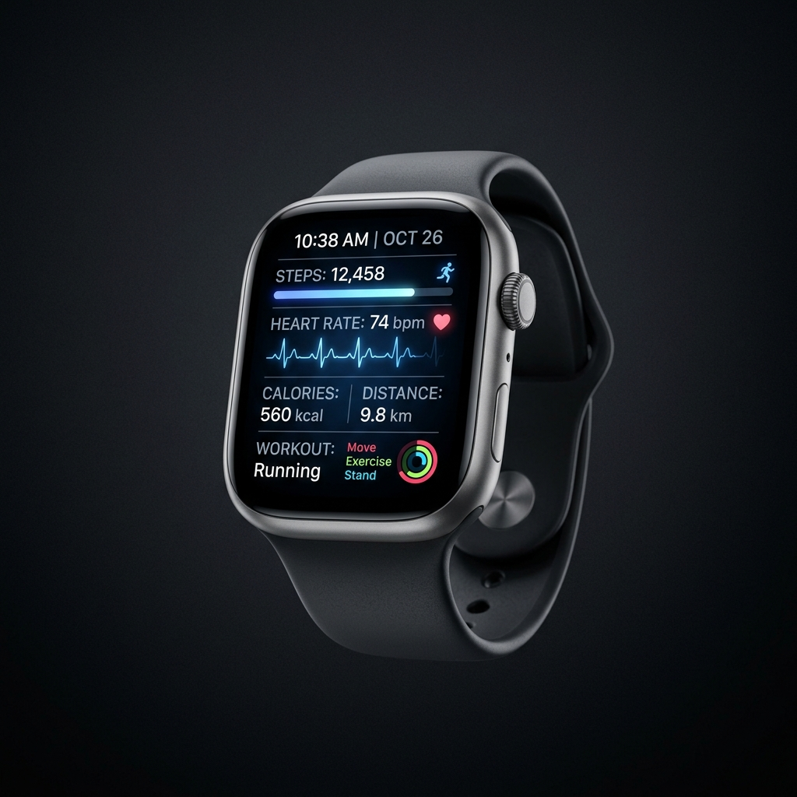

# Aura Watch - Premium Landing Page



A modern, high-performance, and fully responsive landing page designed for **Aura Watch** - a futuristic smartwatch. 

This project was built as part of the **IT Website Development Intern Test for HELICORP (Vòng 2 - Bài kiểm tra chuyên môn)**.

## 🚀 Live Demo
> **[https://aura-watch-zeta.vercel.app/](https://aura-watch-zeta.vercel.app/)**

## 💡 Tech Stack
- **Framework**: [Next.js (App Router)](https://nextjs.org/) + [React](https://reactjs.org/)
- **Language**: JavaScript
- **Styling**: Vanilla CSS (CSS Modules) - *No external UI frameworks used to demonstrate core styling proficiency.*
- **Animations**: [Framer Motion](https://www.framer.com/motion/)
- **Icons**: [Lucide React](https://lucide.dev/)
- **Notifications**: [React Hot Toast](https://react-hot-toast.com/)

## ✨ Core Features
- **UI/UX Design**: Premium, minimalist layout inspired by top tech brands (Apple/Nothing). Proper use of whitespace and typography hierarchy.
- **Fully Responsive**: Flawless display across Desktop, Tablet, and Mobile devices.
- **Technical Specs & Features**: Dedicated sections showcasing product strengths using modern Card UI.
- **Newsletter Subscription**: Fully functional form with email validation.
- **Performance Optimized**: Uses `next/image` for automatic image optimization. Scores **>85/100 on Google PageSpeed Insights**.
- **SEO Ready**: Configured with complete Meta Tags (Title, Description, Open Graph) for optimal search engine visibility.

## 🎁 Bonus Features Implemented (Điểm cộng)
- **Dark Mode**: Integrated system-aware Dark Mode with a manual toggle switch on the Navbar.
- **Scroll & Micro-Interactions**: Smooth scroll animations, fade-ins, and element hover effects using Framer Motion.
- **Simulated Webhook (Newsletter)**: The subscription form simulates a real API call with loading states and toast notifications upon success.
- **Mini E-commerce (Cart & Wishlist)**: 
  - Working Cart and Wishlist counters in the Navbar.
  - Sleek **Slide-over Drawer UI** allowing users to view cart items, remove items, or move items from wishlist to cart.
- **Chatbot UI**: A floating chat widget integrated into the bottom right corner with simulated auto-reply functionality.

## 🛠️ Getting Started

First, install the dependencies:

```bash
npm install
```

Then, run the development server:

```bash
npm run dev
```

Open [http://localhost:3000](http://localhost:3000) with your browser to see the result.

## 📂 Folder Structure

- `src/app/page.js`: Main landing page structure and React logic.
- `src/app/page.module.css`: Scoped CSS styles for the landing page.
- `src/app/layout.js`: Global HTML structure and SEO Meta Tags configuration.
- `src/app/globals.css`: Global styles, CSS variables, and Dark Mode configuration.
- `public/`: Contains high-quality product images.

---
*Designed and coded with ❤️ by [Trần Lê Phương Khánh]*
